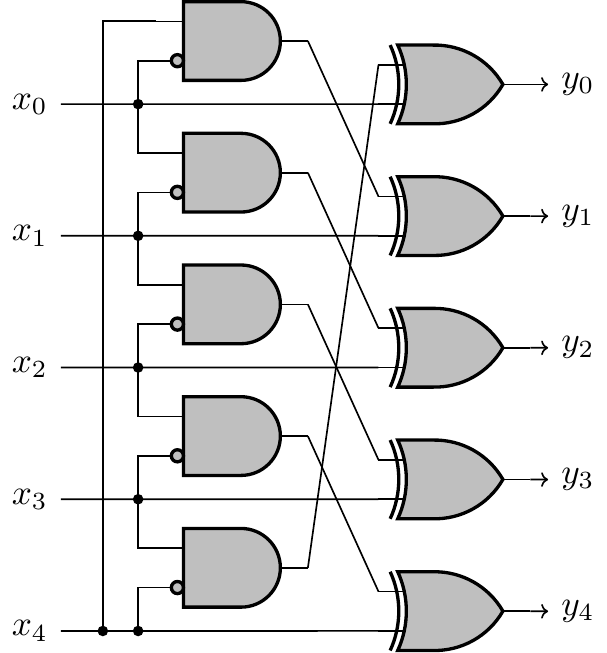

# DEBUTANT > HARDWARE

## Description
Plongez dans le mystère du circuit logique présenté dans l'image `circuit.png` et déchiffrez sa sortie binaire pour l'entrée donnée `(x0, x1, x2, x3, x4) = (1, 0, 0, 1, 1)`. Votre réponse, sous forme binaire, doit être encadrée par les acclamations de FCSC{} pour débloquer le flag tant convoité!

🚀 Par exemple, si l'entrée `(x0, x1, x2, x3, x4) = (1, 0, 0, 0, 0)` conduit à la sortie `(y0, y1, y2, y3, y4) = (1, 0, 1, 0, 0)`, le flag serait HIU{10000}.

À vos outils, et que la force binaire soit avec vous! 💡