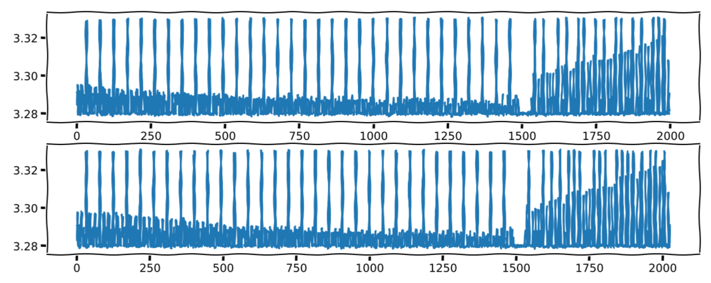

# DIFFICILE > HARDWARE

## Description
La célèbre entreprise **Techzara** vient de lancer une mise à jour critique de sécurité, destinée à renforcer la forteresse de leurs serveurs. Mais, oh surprise, en épluchant le code, vous découvrez une méthode d'exponentiation des plus intrigantes :

```c
unsigned long exp_by_squaring(unsigned long x, unsigned long n) {
  // n est l'exposant secret
  if (n == 0) {
    return 1;
  } else if (n % 2 == 0) {
    return exp_by_squaring(x * x, n / 2);
  } else {
    return x * exp_by_squaring(x * x, (n - 1) / 2);
  }
}
```

Armé de votre curiosité et de votre clavier, vous avez réussi à exécuter la fonction `exp_by_squaring(2, 2727955623)` sur un serveur de test, et ô miracle, vous avez pu enregistrer sa consommation d'énergie dans le fichier 📁 `user_history.csv`. L'exposant mystère `n = 2727955623` (soit `10100010100110010100110010100111` en binaire) ne cache plus de secrets pour vous.

Mais ce n'est que le début de votre aventure ! Vous avez également mis la main sur une trace de consommation d'énergie d'une opération similaire effectuée par l'administrateur de MegaSecure, enregistrée dans 📁 `admin_history.csv`.

🔍 **Votre Mission :** Réussirez-vous à déchiffrer l'exposant secret de l'administrateur à partir de cette nouvelle trace énigmatique ?



🏁 **Le Graal :** Le flag est caché et attend d'être découvert au format `HIU{exposant_secret}` où `exposant_secret` est le nombre mystérieux que vous aurez à révéler, converti en décimal.

---

Bonne chance, agents ! Que la force de la logique et de la persévérance soit avec vous dans cette quête épique au cœur de la cybersécurité ! 💻🔐